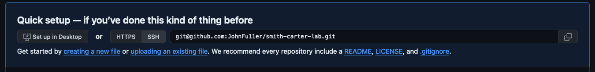
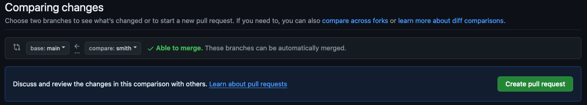
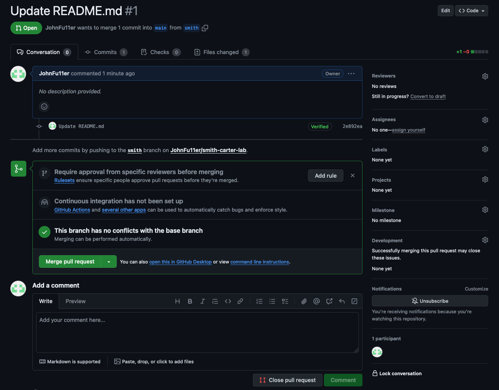
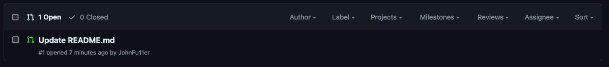

#GitHub Lab
### Sections
- [Resources](#resources)
- [Introduction](#introduction)
- [Configuring SSH authentication](#configuring-ssh-authentication-to-github)
- [Creating a Remote GitHub Repository](#creating-a-remote-github-repository)
- [Make The Initial Commit to your Repository](#make-the-initial-commit-to-your-repository)
- [Create Two New Branches](#create-two-new-branches)
- [Student 2 Edits Their Branch](#student-2-edits-their-branch)
- [Student_2 creates a pull request on GitHub](#student_2-creates-a-pull-request-on-github)
- [Student_1 Merges Student_2's branch into main](#student_1-merges-student_2s-branch-into-main)
- [Student_1 Updates their local repo to view the changes to main](#student_1-updates-their-local-repo-to-view-the-changes-to-main)
- [Student_1 rebase their branch to the main branch](#student_1-rebase-their-branch-to-the-main-branch)
- [Student_2 local repository cleanup](#student_2-local-repository-cleanup)
- [Conclusion](#conclusion)


### Resources
- [Git Documentation](https://git-scm.com/doc)
- [GitHub](https://github.com)
- [GitHub Markdown Formatting](https://docs.github.com/en/get-started/writing-on-github/getting-started-with-writing-and-formatting-on-github/basic-writing-and-formatting-syntax)

### Introduction
- This lab will walk you through some of the most common git actions using the GitHub Source Control Management (SCM) developer platform

### Configuring SSH authentication to GitHub
- Create an SSH keypair on your computer
  - Skip this step if you have previously setup an SSH keypair with GitHub
  - Open a terminal window on your computer
  - Run the following command to generate an ssh keypair
    ```
    ssh-keygen -t rsa -b 4096
    ```
  - Accept all of the defaults by pressing enter on each prompt that is asking for input. There is no need to enter anything. Just press enter until you get to the bottom of the page
  - Navigate to the `~/.ssh` directory
    ```
    cd ~/.ssh
    ```
  - Display the contents of your public SSH key
    ```
    cat id_rsa.pub
    ```
  - Copy the entire public key
- Configure your GitHub profile to use your SSH keypair
  - Navigate to [https://github.com](https://github.com) and login
  - Click on your `user icon` in the top right of the GitHub page
  - Click on `Settings` in the drop-down
  - Click on `SSH and GPG keys` on the left-side of the settings page
  - Click on `New SSH Key`
  - Enter a name in the `Title` section
  - Paste your public key into the `Key` box
  - Click `Add SSH key`
  - Your key has been added

### Creating a Remote GitHub Repository
- Navigate to [https://github.com](https://github.com) and login
- Click on the green button labelled `New`

  

- On the `New repository` creation page:
  - Enter a repository name that is the last names of the two partners completing this lab
    - Example: John Smith, and Jill Carter will make the repo `smith-carter-lab`
  - Leave description blank
  - Select the `Public` button
  - Click `Create repository` at the bottom of the page
  - From this point on, I will refer to the two students as `Student_1` and `Student_2` for ease of understanding

### Make The Initial Commit to your Repository
- Clone the repository to your local computer
  - Copy the SSH clone link on your new repository's main page
    
  - Open your terminal window and navigate to the directory where you want to clone your remote repository
  - Clone the remote repository to your computer (this is an example, yours will be diferent)
    ```
    git clone git@github.com:JohnFu11er/smith-carter-lab.git
    ```
- Create your first commit
  - Change into the new directory that was created when you cloned your repository
  - `Student_1` will perform the next steps:
    1. Create a new file named `README.md` in the repository's directory
    2. Add the following text to the `README.md` file
       ```
       # GitHub Lab Example
       - Student_1 creates the file
       ```
    3. From the terminal line add your changes to the staging area
       ```
       git add .
       ```
    4. From the terminal commit your changes that are in the staging area
       ```
       git commit -m "initial commit"
       ```
    5. Push your changes to the remote repository on GitHub.com
       ```
       git push
       ```
  - Both students can now go to the repository on GitHub.com and both should see the changes made to the README.md file
  - `Student_2`
    1. Open your local repository's directory and notice that the README.md file that the other student created is not there
    2. Pull the changes from the remote repository on GitHub.com onto the local repository on your computer. In the terminal, open your local repository and run the command:
       ```
       git pull
       ```
    3. You should notice that the README.md file is now in your local repository directory

### Create Two New Branches
- Each student will go to the GitHub repository and add a branch
  - Navigate to the GitHub repository that you created above
  - Click on the drop-down labeled `main` in the upper left side of the screen
  - In the input field that says `"Find or create a branch..."` enter your last name. Each of the two students will creat a branch with their last name
  - Click on the text that says `"Create branch <your_last_name> from main"`
  - At this point there should be three branches in your repository: `main`, and two student branches

### Student 2 Edits Their Branch
- On your computer, go your local repository
- List the available branches
  ```
  git branch -r
  ```
- You will not see your branch yet, because your local repository has not been updated to reflect the branches that exist on the remote repository
- Update your local repository to match the remote repository by using the `pull` command
  ```
  git pull
  ```
- List the available branches again, and this time you should see your branch
  ```
  git branch -r
  ```
- Now that you can see your branch is available for checkout, let's first verify which branch you are currently on
  ```
  git branch
  ```
- You should see the word `main` displayed in green, or with an arrow next to it depending on your operating system. This means that you are on the main branch
- Switch to the branch that you created (the name of the branch should be your last name) by using the `git checkout` command
  ```
  git checkout <your_branch_name>
  ```
  - Example:
    ```
    git checkout smith
    ```
- Verify that you are on your branch
  ```
  git branch
  ```
- You should see a listing of branch names, but main is no longer highlighted; now your branch is highlighted. This indicates that you are on your branch and not the main branch
- Add the following code to the `README.md` file
  ```
  - Student_2 adds a new line in their branch
  ```
- Their `README.md` file should now show
  ```
  # GitHub Lab Example
  - Student_1 creates the file
  - Student_2 adds a new line in their branch
  ```
- Stage the changes to your branch from the terminal. You must be in the directory of your local repository
  ```
  git add .
  ```
- Commit your changes to your local repository using the commit comment of "Student_2 adds a line"
  ```
  git commit -m "Student_2 adds a line"
  ```
- Push your branch's changes to the remote repository on GitHub
  ```
  git push
  ```

### Student_2 creates a pull request on GitHub
- Student_2, go to the GitHub page for your repository
- Switch to your branch by clicking on the drop-down list that says `main` and clicking on your branch name
- Open the `README.md` file and verify that your most recent changes are there
- Click on the `Pull requests` link at the top of the GitHub page
- Click on the green `New pull request` button
- On the `Compare changes` page, you will see two drop-down menus next to each other. The one on the left should say `main`. In the right drop-down, select your branch
- You should see the `Create pull request` button turn a bright green

  

- Click `Create pull request`
- On the next screen, scroll to the bottom of the page and you will see a list of the changes that you made to the code. Additions are in green, and deletions are in red
- Scroll back up and click on the `Create pull request` button
- You should see the following

  

- Find the green `Merge pull request` button and click on the small drop-down arrow next to the button
- In the dropdown, click on `Rebase and merge`
- The `Merge pull request` button should now say `Rebase and merge`

### Student_1 Merges Student_2's branch into main
- Student_1, you will click on the `Pull requests` link at the top of the page
- You should see the pull request that `Student_2` created.  It will look similar to this

  

- Click on `Student_2's pull request
- Click on the green `Rebase and merge` button
- Click on the green `Confirm merge` button
- Click `Delete branch` button
  - This is a common practice so that a branch is used only to make a specific change to a section of code. A branch is usually associated with the development of a feature for the larger application. Best practice is to keep the changes as small as possible. There is no set number of changes for a branch, but it should not be more than around a hundred lines in common practice.
- Click on the `Code` link at the top of the GitHub page
- Click on the branch drop-down labeled `main` and verify that the branch made by `Student_2` has been deleted and is no longer listed.
  - If `Student_2` creates a new branch at a later date, it is good practice to use a branch name that has not been used before.
  - Example new branch name for `Student_2`
    ```
    smith-2
    ```
- Verify that the pull request was successful by opening the `README.md` file. You should see the following code
  ```
  # GitHub Lab Example
  - Student_1 creates the file
  - Student_2 adds a new line in their branch
  ```

### Student_1 Updates their local repo to view the changes to main
- Student_1, go to your terminal line. Make sure that you are in your local repository's directory
- Verify that you are on the main branch
  ```
  git branch
  ```
- You should see `main` highlighted
- View the `README.md` file and you should see the following code in it
  ```
  # GitHub Lab Example
  - Student_1 creates the file
  ```
- Pull down the changes made to the `main` branch on the remote repository
  ```
  git pull
  ```
- View the `README.md` file and you should see the following code in it
  ```
  # GitHub Lab Example
  - Student_1 creates the file
  - Student_2 adds a new line in their branch
  ```

### Student_1 rebase their branch to the main branch
- Student_1, go to your terminal line. Make sure that you are in your local repository's directory
- At this point you should have two branches listed in the output of your `git branch -r` command; `main` branch and your branch
- Since you have performed a pull, your local repository `main` branch is up to date with what is on the remote repository `main` branch
- However, your branch does not have the changes added to the remote repository `main` branch
- To add the changes in the remote repository `main` branch to your branch we are going to use the rebase command
- First change to your branch in your local repository
  ```
  git checkout <your_branch_name>
  ```
- Next, run the rebase command and designate the `main` branch as the one that you want to `rebase` to
  ```
  git rebase main
  ```
- Now, any code that was in your local branch will have any changes from the `main` branch added to it
- Rebasing is a very important topic in using git (either GitHub, GitLab, or other SCM programs)

### Student_2 local repository cleanup
- Student_2, go to your terminal line. Make sure that you are in your local repository's directory
- Checkout (switch to) the `main` branch
  ```
  git checkout main
  ```
- Pull down the changes to the `main` branch from the remote repository on GitHub
  ```
  git pull
  ```
- List the branches on your local repository. You should see the `main` branch and your branch
  ```
  git branch
  ```
- Remove your branch on your local repository. This branch was merged into `main` in the steps above
  ```
  git branch -D <your_branch_name>
  ```
- List the branches on your local repository again, and you should see that your branch is no longer listed

### Conclusion
- This should give you a basic understanding of working with GitHub
- You can go through this lab again by making a new repository, or you can have Student_1 make changes to their branch and push those changes to the remote repo, create a pull request, merge the code, etc...
